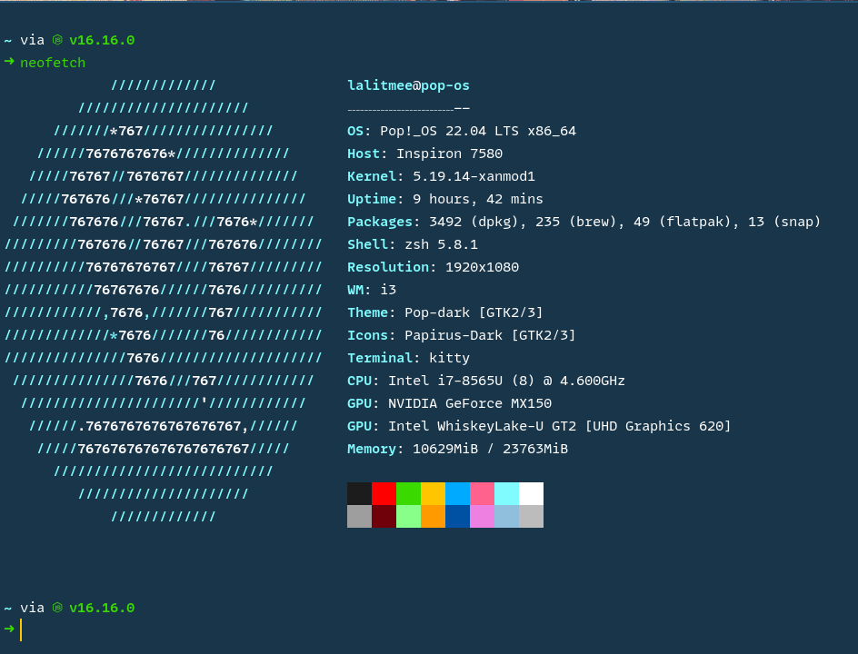
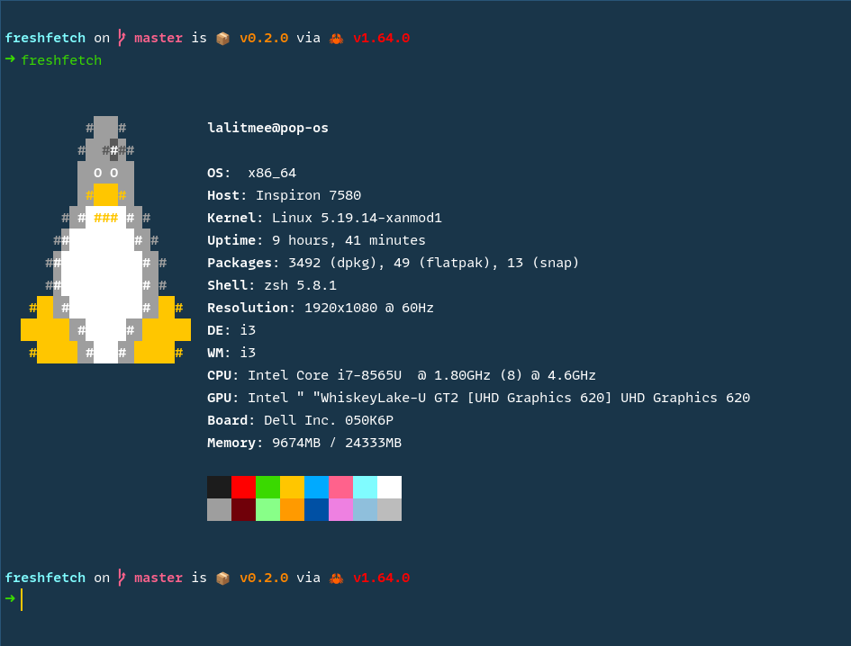

<div align="center">

# kitty-cobalt2

##### Don't stress your eyes now

[](https://github.com/lalitmee/kitty-cobalt2/blob/main/LICENSE)
[](https://github.com/lalitmee/kitty-cobalt2/stargazers)

</div>

cobalt2 theme for [kitty-terminal](https://sw.kovidgoyal.net/kitty/)

## neofetch



## freshfetch



## Installation

Just run this command in your terminal

```bash
curl https://raw.githubusercontent.com/lalitmee/kitty-cobalt2/master/install.sh | bash
```

ENJOY! 🙂

## Acknowledgements

- [catppuccin/kitty](https://github.com/catppuccin/kitty)
